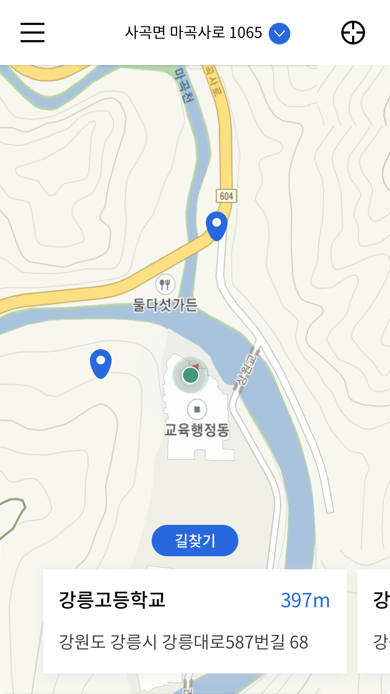
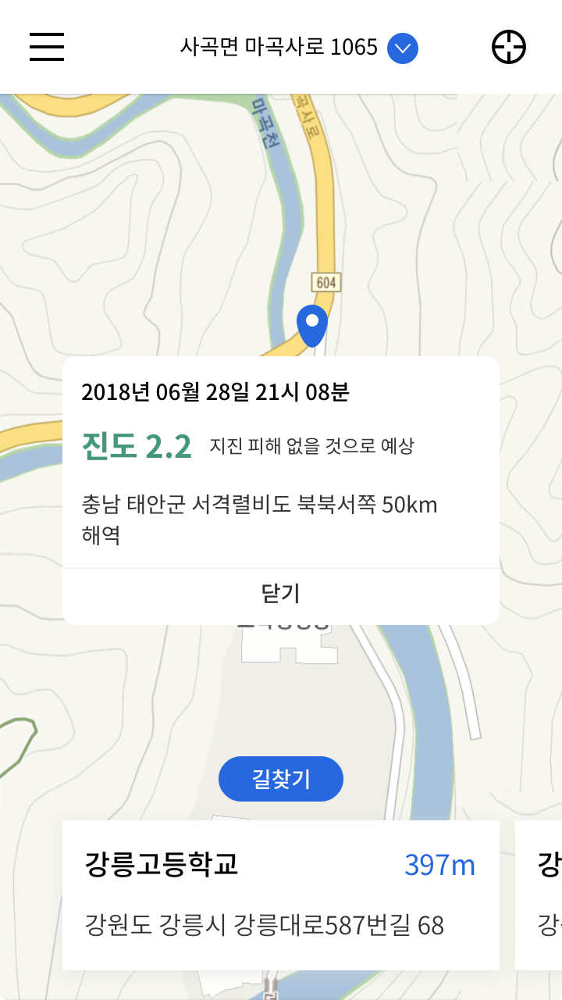
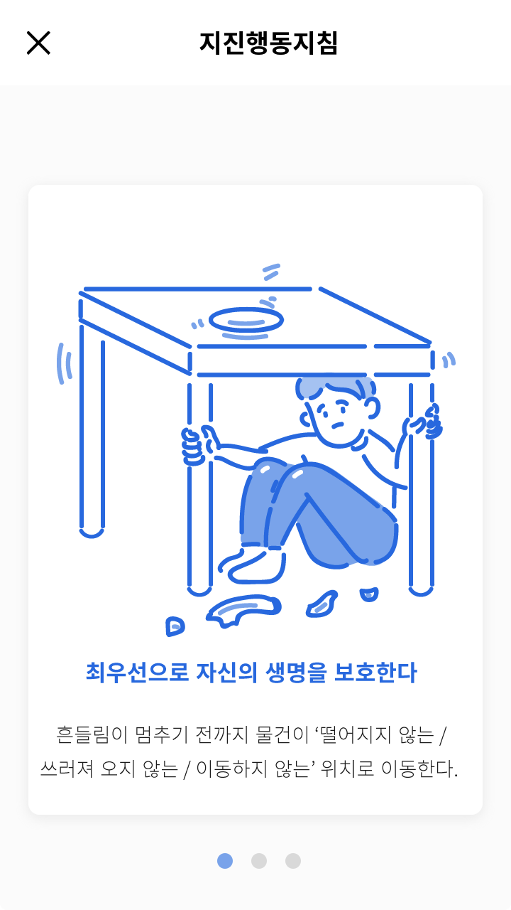

<p align="middle">
  
</p>

# ESQUAKE: 지진에서 탈출하라!!
## Introduction
#### 🏃‍♀️ Escape+Earthquake : 지진에서 탈출하라! 🏃‍♂️


ESQUAKE는  지진 발생 알림과 동시에 가장 가까운 대피소를 알려주는 어플리케이션입니다.

강진이 발생했을 경우, 아무것도 생각이 나지 않는 혼란 속에 빠지게 됩니다. 

만약 혼자 낯선 곳에서 강한 지진을 겪게 된다면 의지할 곳은 스마트폰 밖에 없겠죠. 

그러나, 공포에 떨고 두려움이 가득한 상황 속에서 침착하게 주변 대피소를 찾는 것은 사실상 불가능에 가깝습니다. 

그래서 저희 어플리케이션은 지진 발생 시 푸쉬 알림을 제공함과 동시에, **가장 가까운 대피소**를 바로 알려줍니다.

## Overview
### 메인화면
> 앱을 켜자마자 GPS 주소 혹은 입력된 주소를 기준으로 가까운 대피소를 하단 카드 형식으로 볼 수 있습니다.

<p align="center">
  
</p>

### 지진 푸시를 통해 들어왔을 경우
> 현재 온 지진에 대한 정보와 함께 GPS 주소 혹은 입력 주소 기준 가까운 대피소를 하단 카드 형식으로 볼 수 있습니다.

<p align="center">
  
</p>

### 대피소 리스트
> 하단 카드를 누르면 총 인원, 전화번호를 포함한 대피소의 더 자세한 정보를 리스트 형식으로 볼 수 있습니다.

<p align="center">
  
</p>

### 지진행동지침
> 앱 내 데이터베이스에 저장된 지진행동지침 핸드북을 볼 수 있습니다. 인터넷 연결이 안되는 상황에도 열람이 가능합니다.

<p align="center">
  
</p>


## License
Copyright (C) 2018-present,  OpenHackEsquake

```
Permission is hereby granted, free of charge, to any person obtaining a copy of this software and associated documentation files (the "Software"), to deal in the Software without restriction, including without limitation the rights to use, copy, modify, merge, publish, distribute, sublicense, and/or sell copies of the Software, and to permit persons to whom the Software is furnished to do so, subject to the following conditions:

The above copyright notice and this permission notice shall be included in all copies or substantial portions of the Software.

THE SOFTWARE IS PROVIDED "AS IS", WITHOUT WARRANTY OF ANY KIND, EXPRESS OR IMPLIED, INCLUDING BUT NOT LIMITED TO THE WARRANTIES OF MERCHANTABILITY, FITNESS FOR A PARTICULAR PURPOSE AND NONINFRINGEMENT. IN NO EVENT SHALL THE AUTHORS OR COPYRIGHT HOLDERS BE LIABLE FOR ANY CLAIM, DAMAGES OR OTHER LIABILITY, WHETHER IN AN ACTION OF CONTRACT, TORT OR OTHERWISE, ARISING FROM, OUT OF OR IN CONNECTION WITH THE SOFTWARE OR THE USE OR OTHER DEALINGS IN THE SOFTWARE.
